# UML del Proyecto

Este proyecto no usa clases orientadas a objetos en el backend, pero sí se puede representar muy bien con un `classDiagram` de Mermaid modelando módulos, rutas, middlewares y entidades principales.

## UML en Mermaid

```mermaid
classDiagram
    class Server {
        +configurarHelmet()
        +configurarCors()
        +configurarSesion()
        +configurarRateLimit()
        +servirPublic()
        +montarRutas()
        +iniciar()
    }

    class DB {
        +createPool()
        +query(sql, params)
        +getConnection()
        +ensureLoginAttemptsTable()
    }

    class AuthMiddleware {
        +requireAuth(req, res, next)
        +requireRole(...roles)
    }

    class UploadMiddleware {
        +storage
        +fileFilter(req, file, cb)
        +limits
    }

    class AuthRoutes {
        +register()
        +registerAdmin()
        +login()
        +logout()
        +me()
        +obtenerIntentoLogin()
        +registrarIntentoFallido()
        +limpiarIntentosLogin()
    }

    class AdminRoutes {
        +dashboard()
        +actividad()
        +usuarios()
        +crearUsuario()
        +editarUsuario()
        +eliminarUsuario()
        +reportes()
        +clases()
    }

    class DocenteRoutes {
        +misClases()
        +crearClase()
        +editarClase()
        +eliminarClase()
        +estudiantesPorClase()
    }

    class EstudianteRoutes {
        +dashboard()
        +unirseClase()
        +misClases()
        +companeros()
        +clase()
        +entregarTarea()
        +asistencia()
        +tareas()
        +materiales()
    }

    class MaterialesRoutes {
        +subirMaterial()
        +listarMateriales()
    }

    class TareasRoutes {
        +crearTarea()
        +listarTareas()
        +entregas()
        +calificar()
    }

    class AsistenciaRoutes {
        +consultarAsistencia()
        +guardarAsistencia()
    }

    class Usuario {
        +id : int
        +nombre : string
        +correo : string
        +password : string
        +rol : enum
        +dui : string
        +tipo_bachillerato : enum
        +anio : enum
        +telefono : string
    }

    class LoginIntento {
        +correo : string
        +intentos_fallidos : int
        +bloqueado_hasta : datetime
        +ultimo_intento : timestamp
    }

    class Materia {
        +id : int
        +nombre : string
    }

    class DocenteMateria {
        +id : int
        +docente_id : int
        +materia_id : int
        +grado : string
        +seccion : string
        +codigo_clase : string
    }

    class EstudianteMateria {
        +id : int
        +estudiante_id : int
        +docente_materia_id : int
    }

    class Material {
        +id : int
        +docente_materia_id : int
        +titulo : string
        +descripcion : text
        +archivo : string
        +tipo : string
        +fecha_subida : timestamp
    }

    class Tarea {
        +id : int
        +docente_materia_id : int
        +titulo : string
        +descripcion : text
        +archivo : string
        +fecha_entrega : datetime
        +valor : decimal
    }

    class EntregaTarea {
        +id : int
        +tarea_id : int
        +estudiante_id : int
        +archivo : string
        +comentario : text
        +nota : decimal
        +estado : enum
    }

    class Asistencia {
        +id : int
        +docente_materia_id : int
        +estudiante_id : int
        +fecha : date
        +presente : boolean
    }

    Server --> DB : usa
    Server --> AuthRoutes : monta
    Server --> AdminRoutes : monta
    Server --> DocenteRoutes : monta
    Server --> EstudianteRoutes : monta
    Server --> MaterialesRoutes : monta
    Server --> TareasRoutes : monta
    Server --> AsistenciaRoutes : monta
    Server --> AuthMiddleware : aplica
    Server --> UploadMiddleware : aplica

    AuthRoutes --> DB : consulta
    AdminRoutes --> DB : consulta
    DocenteRoutes --> DB : consulta
    EstudianteRoutes --> DB : consulta
    MaterialesRoutes --> DB : consulta
    TareasRoutes --> DB : consulta
    AsistenciaRoutes --> DB : consulta

    DocenteRoutes --> AuthMiddleware : protege
    EstudianteRoutes --> AuthMiddleware : protege
    AdminRoutes --> AuthMiddleware : protege
    MaterialesRoutes --> UploadMiddleware : usa
    EstudianteRoutes --> UploadMiddleware : usa

    Usuario "1" --> "0..*" DocenteMateria : imparte
    Materia "1" --> "0..*" DocenteMateria : define
    Usuario "1" --> "0..*" EstudianteMateria : se_inscribe
    DocenteMateria "1" --> "0..*" EstudianteMateria : admite
    DocenteMateria "1" --> "0..*" Material : publica
    DocenteMateria "1" --> "0..*" Tarea : asigna
    Tarea "1" --> "0..*" EntregaTarea : recibe
    Usuario "1" --> "0..*" EntregaTarea : entrega
    DocenteMateria "1" --> "0..*" Asistencia : registra
    Usuario "1" --> "0..*" Asistencia : acumula
    Usuario "1" --> "0..1" LoginIntento : puede_bloquearse
```

## Qué representa

- `Server`: composición principal de Express.
- `DB`: acceso centralizado a MySQL.
- `Routes`: módulos funcionales del backend.
- `AuthMiddleware` y `UploadMiddleware`: reglas transversales.
- Entidades: reflejan las tablas principales de la base de datos.

## Uso rápido

- GitHub renderiza Mermaid directamente en Markdown.
- También puedes pegar este bloque en [Mermaid Live Editor](https://mermaid.live/).
- Si quieres, después te puedo hacer una segunda versión tipo `flowchart` o una `sequenceDiagram` del login.
